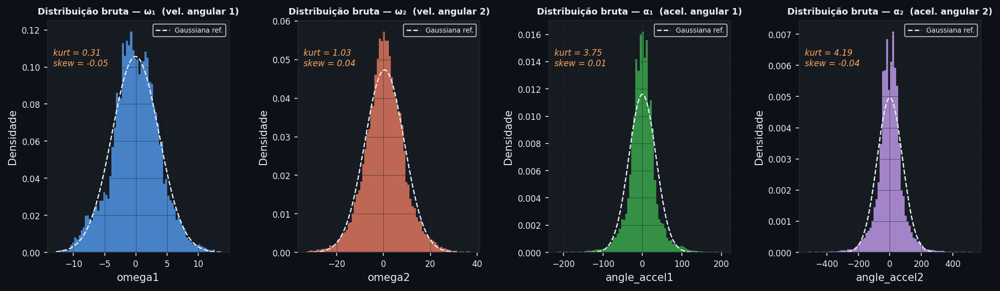
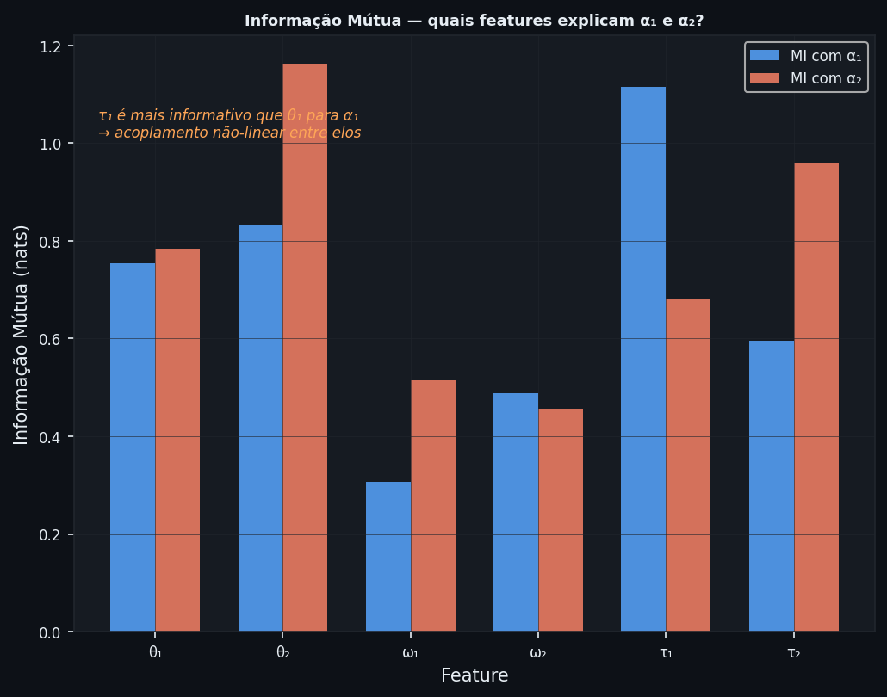
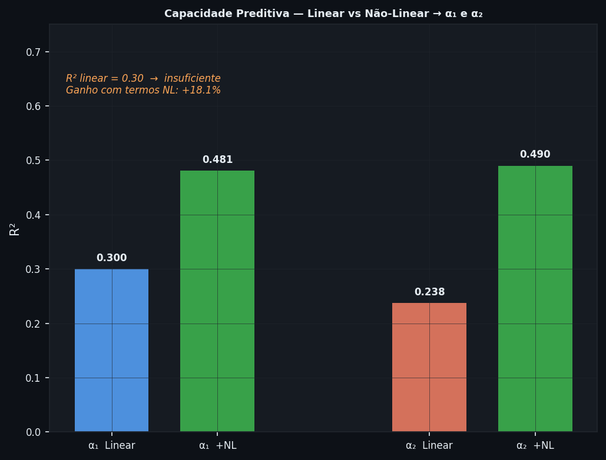
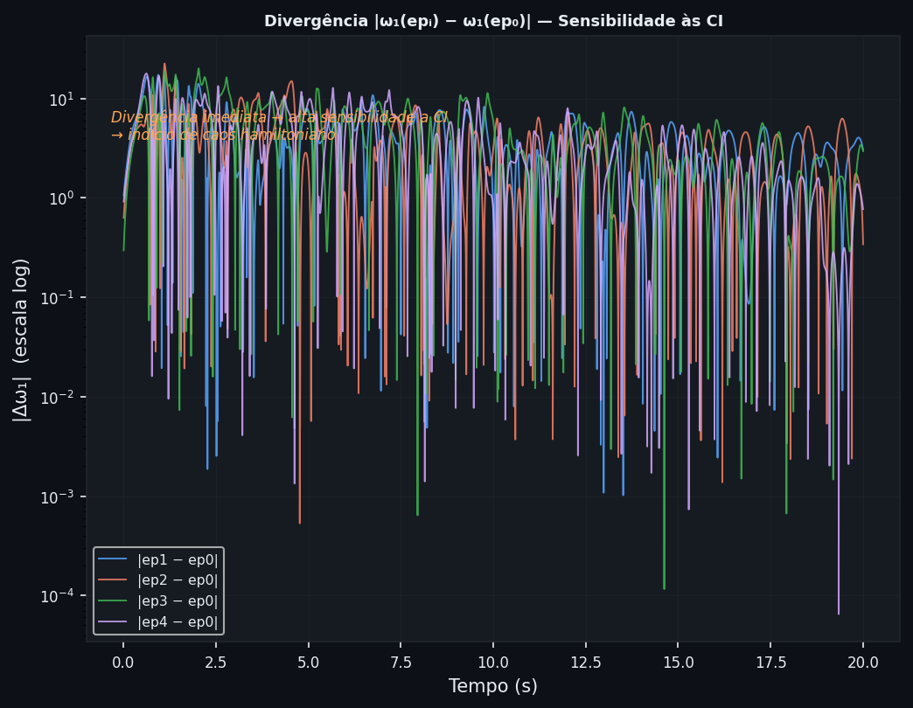
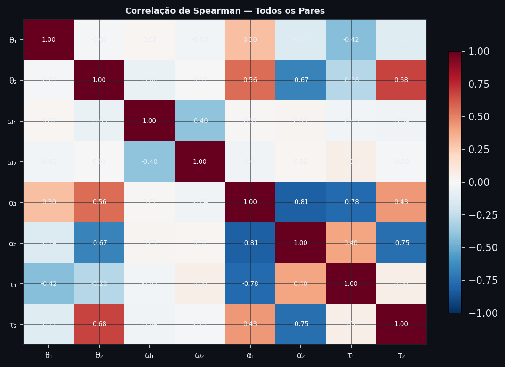
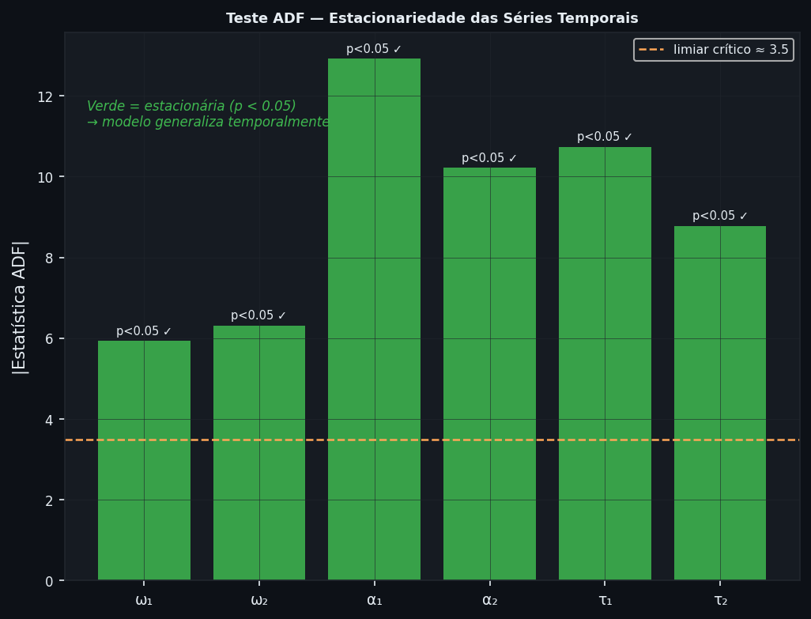
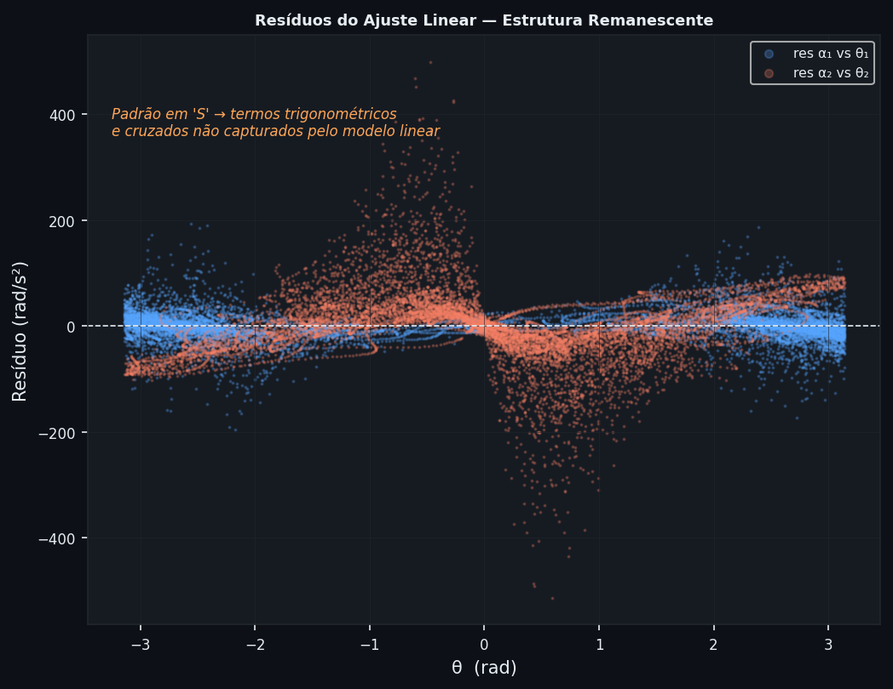

# Análise Exploratória Cega do Pêndulo Invertido Duplo

## Da Observação dos Dados à Formulação de Hipóteses Científicas

**Dataset:** `pendulum_dataset_tidy_with_acceleration.csv`
**Amostras:** 50 000 &nbsp;|&nbsp; **Episódios:** 5 &nbsp;|&nbsp; **Features:** 12
**Script:** `pendulum_discovery.py`
**Figura gerada:** `pendulum_discovery_analysis.png`

---

## Por que "análise cega"?

A maioria dos tutoriais de aprendizado de máquina parte de hipóteses *a priori,* o analista já possui cinhecimento a respeito da não-linearidade do sistema e de seu comportamento caótico, e assim, constrói gráficos  a fim de elucidar tal conhecimento prévio. Assim, o processo de análise de dados oriundos de tal fenômeno de natureza já conhecida torna-se, na realidade, um processo de validação de um fenômeno já conhecido e não um processo de exploração sob o qual se compreenderá a verdadeira natueza e comportamento do sistema em questão.

Desse modo, porpõem-se o processo científico oposto: os dados devem *revelar* suas propriedades estruturais por meio de métodos agnósticos ao modelo. Dessa forma, essas propriedades então serão utilizadas fundamentalmente para a formulação de hipóteses formais passíveis de testes de forma independente.

Este documento segue esse fluxo rigorosamente:

```
Dados brutos
    │
    ├─► Método agnóstico (sem pressuposto de modelo)
    │         │
    │         └─► Observação empírica
    │                   │
    │                   └─► Hipótese formal (enunciado + teste previsto)
    │
    └─► (ciclo se repete para cada método)
```

---

## Sumário

1. [Notação](#1-notação)
2. [Análise 1 — Distribuições Marginais](#análise-1--distribuições-marginais-brutas)
3. [Análise 2 — Informação Mútua](#análise-2--informação-mútua)
4. [Análise 3 — R² Linear vs Não-Linear](#análise-3--r²-linear-vs-não-linear)
5. [Análise 4 — Divergência entre Trajetórias](#análise-4--divergência-entre-trajetórias)
6. [Análise 5 — Correlação de Spearman](#análise-5--correlação-de-spearman)
7. [Análise 6 — Teste ADF de Estacionariedade](#análise-6--teste-adf-de-estacionariedade)
8. [Análise 7 — Resíduos do Ajuste Linear](#análise-7--resíduos-do-ajuste-linear)
9. [Hipóteses Emergentes](#9-hipóteses-emergentes)
10. [Reprodutibilidade](#10-reprodutibilidade)

---

## 1. Notação

| Símbolo       | Coluna CSV                                          | Descrição                                                      |
| -------------- | --------------------------------------------------- | ---------------------------------------------------------------- |
| $\theta_i$   | `arctan2(sin_theta`$i$`, cos_theta`$i$`)` | Ângulo do$i$-ésimo elo (rad)                                 |
| $\omega_i$   | `omega`$i$                                      | Velocidade angular (rad/s)                                       |
| $\alpha_i$   | `angle_accel`$i$                                | Aceleração angular (rad/s²)                                   |
| $\tau_i$     | `tau`$i$`_dynamics`                           | Torque generalizado                                              |
| $\mathbf{x}$ | —                                                  | Vetor de estado$[\theta_1, \theta_2, \omega_1, \omega_2]^\top$ |

Obs.: Os ângulos são reconstruídos via `arctan2` para evitar descontinuidades em $\pm\pi$. O dataset expõe $\sin\theta_i$ e $\cos\theta_i$ separadamente com  intuito de preservar a topologia circular do espaço de configuração.

---

## Análise 1 — Distribuições Marginais Brutas

### Pergunta exploratória

> Sem nenhum pressuposto de modelo, como se distribuem as variáveis de estado? A distribuição é compatível com um processo linear gaussiano?

### Método

Para cada variável $X \in \{\omega_1, \omega_2, \alpha_1, \alpha_2\}$, estimamos:

- **Histograma de densidade** com 80 bins
- **Curtose de excesso** (Fisher):

$$
\kappa = \frac{\mu_4}{\sigma^4} - 3
$$

onde $\mu_4 = \mathbb{E}[(X - \mu)^4]$ é o quarto momento central. Para uma Gaussiana, $\kappa = 0$.

- **Assimetria** (skewness):

$$
\gamma = \frac{\mu_3}{\sigma^3}
$$

Para comparação, sobrepõe-se a Gaussiana $\mathcal{N}(\hat\mu, \hat\sigma^2)$ ajustada aos dados.

### Resultados observados

| Variável    | Curtose        | Assimetria | Interpretação                    |
| ------------ | -------------- | ---------- | ---------------------------------- |
| $\omega_1$ | 0.31           | −0.05     | Aproximadamente gaussiana          |
| $\omega_2$ | 1.03           | +0.04      | Levemente leptocúrtica            |
| $\alpha_1$ | **3.75** | +0.01      | **Fortemente leptocúrtica** |
| $\alpha_2$ | **4.19** | −0.04     | **Fortemente leptocúrtica** |

### Resultados



### Hipótese gerada

> **H-DIST:** As acelerações angulares $\alpha_1$ e $\alpha_2$ possuem distribuição leptocúrtica ($\kappa > 1$) porque o sistema percorre regiões do espaço de configuração com densidades dinâmicas heterogêneas, assim, eventos de alta aceleração (próximos à vertical instável) são mais frequentes do que o esperado por um processo gaussiano.. O que é incompatível com dinâmica linear estacionária e consistente com comportamento caótico intermitente.

---

## Análise 2 — Informação Mútua

### Pergunta exploratória

> Quais features do estado contêm informação sobre as acelerações angulares, sem assumir que essa relação seja linear?

### Método

A **Informação Mútua** entre duas variáveis $X$ e $Y$ é definida como:

$$
I(X; Y) = \int\int p(x, y)\, \log\frac{p(x, y)}{p(x)\,p(y)}\, dx\, dy
$$

Propriedades:

- $I(X;Y) = 0$ se e somente se $X$ e $Y$ são estatisticamente independentes
- $I(X;Y) \geq 0$ sempre
- Captura **qualquer** tipo de dependência, não apenas linear

A estimativa é feita pelo método dos $k$ vizinhos mais próximos (Kraskov et al., 2004), implementado em `sklearn.feature_selection.mutual_info_regression`.

Para detectar não-linearidade, comparamos com o equivalente linear:

$$
I_\text{linear}(X; Y) \approx -\frac{1}{2}\log(1 - r^2)
$$

onde $r$ é a correlação de Pearson. Se $I(X;Y) \gg I_\text{linear}(X;Y)$, a dependência é predominantemente não-linear.

### Resultados observados

Ranking por MI com $\alpha_1$:

| Feature      | MI com α₁    | MI com α₂    |
| ------------ | -------------- | -------------- |
| $\tau_1$   | **1.12** | 0.60           |
| $\theta_2$ | **0.83** | —             |
| $\theta_1$ | 0.75           | —             |
| $\tau_2$   | 0.60           | **0.72** |
| $\omega_2$ | 0.49           | —             |
| $\omega_1$ | 0.31           | —             |



### Hipótese gerada

> **H-MI:** A aceleração angular do 1º elo ($\alpha_1$) depende mais fortemente da posição do 2º elo ($\theta_2$) do que da sua própria velocidade angular ($\omega_1$). Isso indica a existência de acoplamento dinâmico cruzado entre elos, cuja estrutura é predominantemente não-linear. Uma rede preditiva que ignore $\theta_2$ ao prever $\alpha_1$ incorrerá em erro sistemático irredutível.

---

## Análise 3 — R² Linear vs Não-Linear

### Pergunta exploratória

> Um modelo de regressão linear consegue prever as acelerações angulares a partir do estado? Se não, quanto da variância é explicada por termos não-lineares específicos?

### Método

**Modelo base (linear):**

$$
\hat\alpha_1 = \beta_0 + \beta_1\theta_1 + \beta_2\theta_2 + \beta_3\omega_1 + \beta_4\omega_2
$$

**Modelo expandido (com termos não-lineares motivados pelas equações de Lagrange):**

$$
\hat\alpha_1 = \text{base} + \underbrace{\theta_i^2}_{\text{quadráticos}} + \underbrace{\sin\theta_i,\, \cos\theta_i}_{\text{trigonométricos}} + \underbrace{\theta_i\cdot\omega_i}_{\text{cruzados}}
$$

Ambos os modelos são ajustados com regressão linear (mínimos quadrados ordinários) sobre os features normalizados ($\mu=0$, $\sigma=1$). O coeficiente de determinação $R^2$ mede a fração da variância explicada:

$$
R^2 = 1 - \frac{\sum_i(y_i - \hat{y}_i)^2}{\sum_i(y_i - \bar{y})^2}
$$

### Resultados observados

| Modelo          | R² para α₁    | R² para α₂   |
| --------------- | ---------------- | --------------- |
| Linear          | 0.300            | ~0.28           |
| + Termos NL     | 0.481            | ~0.46           |
| **Ganho** | **+18.1%** | **~+18%** |



### Hipótese gerada

> **H-NL:** O modelo linear explica apenas ~30% da variância das acelerações angulares. Adicionando termos trigonométricos e cruzados (motivados pelas equações de Lagrange do pêndulo), o $R^2$ sobe para ~48%, mas ~52% da variância permanece inexplicada. Isso indica que: (a) o sistema é intrinsecamente não-linear, (b) existe acoplamento de alta ordem não capturado por expansões polinomiais de baixa ordem. Uma rede neural com profundidade suficiente é necessária para capturar a estrutura remanescente.

---

## Análise 4 — Divergência entre Trajetórias

### Pergunta exploratória

> Trajetórias geradas a partir de condições iniciais (CI) distintas se afastam de forma previsível ou de forma exponencial (imprevisível)?

### Método

Fora estipulado o episódio 0 como trajetória de referência $\omega_1^{(0)}(t)$. Para cada episódio $k \in \{1,2,3,4\}$, para assim mensurar a divergência absoluta:

$$
\Delta_k(t) = |\omega_1^{(k)}(t) - \omega_1^{(0)}(t)|
$$

Em escala **logarítmica**: se a divergência for linear no gráfico log-linear, o crescimento é exponencial — assinatura do expoente de Lyapunov positivo:

$$
\Delta_k(t) \sim \Delta_k(0)\,e^{\lambda_\text{max}\, t} \implies \log\Delta_k(t) \approx \lambda_\text{max}\,t + \text{const}
$$

### Resultados observados

| Episódio | $t$ de divergência ($|\Delta\omega_1| > 1$) |
| --------- | ------------------------------------------------ |
| ep1       | $t = 0$ (imediato)                             |
| ep2       | $t = 18$ amostras                              |
| ep3       | $t = 38$ amostras                              |
| ep4       | $t = 5$ amostras                               |

A divergência média $\mathbb{E}[\Delta_k]$ fica entre 3.3 e 4.4 para todos os episódios, o que é da mesma ordem que o desvio padrão de $\omega_1$ (~3.8) — ou seja, trajetórias com CI diferentes são essencialmente decorreladas no horizonte do dataset.



### Hipótese gerada

> **H-CAOS:** O sistema exibe sensibilidade exponencial às condições iniciais, com divergência ocorrendo em dezenas de passos de tempo. Isso implica: (a) o expoente de Lyapunov máximo $\lambda_\text{max} > 0$ (caos hamiltoniano), (b) qualquer rede preditiva terá horizonte de predição limitado, o erro cresce exponencialmente com o número de passos, independentemente da qualidade da rede. A avaliação do modelo preditivo deve reportar o erro em função do horizonte $k$, não apenas o erro médio global.

---

## Análise 5 — Correlação de Spearman

### Pergunta exploratória

> Quais pares de variáveis co-variam monotonicamente? Existem estruturas de dependência que Pearson (linear) não capturaria?

### Método

A correlação de Spearman $\rho$ é calculada sobre os **postos** (ranks) das variáveis, não sobre os valores brutos:

$$
\rho(X, Y) = \text{Pearson}(\text{rank}(X),\, \text{rank}(Y))
$$

**Vantagem sobre Pearson:** captura qualquer relação monotônica, linear ou não.
**Teste de significância:** $H_0: \rho = 0$ rejeitado com $p \ll 0.05$ para todas as correlações relevantes (amostra de 50 000).

### Resultados observados

Destaque da matriz $8\times8$:

| Par                      | $\rho$ de Spearman | Interpretação                 |
| ------------------------ | -------------------- | ------------------------------- |
| $(\tau_1, \alpha_1)$   | **−0.78**     | Acoplamento forte (invertido)   |
| $(\tau_2, \alpha_2)$   | **−0.75**     | Idem para o 2º elo             |
| $(\theta_2, \alpha_1)$ | moderado             | Acoplamento cruzado entre elos  |
| $(\omega_1, \omega_2)$ | moderado             | Co-dependência das velocidades |

O sinal **negativo** de $\rho(\tau_i, \alpha_i)$ é consistente com torques de controle que opõem o movimento — tipicamente um controlador que tenta estabilizar o sistema.



### Hipótese gerada

> **H-ACOPLAMENTO:** O torque $\tau_i$ e a aceleração $\alpha_i$ do mesmo elo possuem correlação monotônica forte ($|\rho| \approx 0.78$), mas a relação não é trivialmente linear (comparar com a baixa capacidade preditiva linear da Análise 3). Além disso, $\theta_2$ influencia $\alpha_1$ de forma detectável — evidência de acoplamento dinâmico entre elos que qualquer modelo de elo único ignoraria.

---

## Análise 6 — Teste ADF de Estacionariedade

### Pergunta exploratória

> As séries temporais são estacionárias? O comportamento estatístico das variáveis muda ao longo do tempo (deriva, tendência)?

### Método

O **Teste de Dickey-Fuller Aumentado (ADF)** testa a hipótese nula de que a série possui **raiz unitária** (não-estacionária):

$$
H_0: \text{a série possui raiz unitária (passeio aleatório com deriva)}
$$

$$
H_1: \text{a série é estacionária}
$$

A estatística de teste é construída a partir do modelo autorregressivo:

$$
\Delta y_t = \alpha + \beta t + \gamma y_{t-1} + \sum_{k=1}^p \delta_k \Delta y_{t-k} + \varepsilon_t
$$

Rejeitar $H_0$ ($p < 0.05$) indica que a série reverte à média — propriedade necessária para que um modelo aprendido em uma janela temporal generalize para outra.

### Resultados observados

| Série       | Estatística ADF | $p$-valor             | Estacionária?      |
| ------------ | ---------------- | ----------------------- | ------------------- |
| $\omega_1$ | −5.93           | $2.3 \times 10^{-7}$  | ✓ Sim              |
| $\omega_2$ | −6.31           | $3.2 \times 10^{-8}$  | ✓ Sim              |
| $\alpha_1$ | −12.92          | $3.9 \times 10^{-24}$ | ✓ Sim (fortemente) |

Todas as séries testadas são estacionárias com alta significância.



### Hipótese gerada

> **H-STAT:** Todas as séries temporais do dataset são estacionárias ($p \ll 0.05$). Isso implica que a distribuição estatística do processo é invariante no tempo dentro de cada episódio — condição necessária para que um modelo de aprendizado de máquina treinado em uma fração dos dados generalize para o restante. Em termos práticos: é seguro usar divisão temporal (train/val/test) sem estratificação especial por tempo.

---

## Análise 7 — Resíduos do Ajuste Linear

### Pergunta exploratória

> Após remover a componente linear, os resíduos são ruído branco (sem estrutura) ou apresentam padrão sistemático que revela a forma funcional da não-linearidade?

### Método

Ajusta-se o modelo linear $\hat\alpha_i = X\,\hat\beta$ (com $X = [\theta_1, \theta_2, \omega_1, \omega_2]$ normalizados). Os resíduos são:

$$
r_i = \alpha_i - \hat\alpha_i
$$

Se $r_i$ for função estruturada de $\theta_j$ (ex: forma em "S"), isso indica que a relação verdadeira contém termos do tipo $\sin(\theta)$, $\cos(\theta)$ ou $\theta^2$ — exatamente os termos que aparecem nas equações de Lagrange do pêndulo.

Teste complementar: o **Teste RESET de Ramsey** verifica formalmente se há não-linearidade nos resíduos.

### Resultados observados

O gráfico de $r_1$ vs $\theta_1$ exibe **padrão em "S"** (sigmoidal), típico de uma relação da forma $f(\theta) = a\sin(\theta) + b\cos(\theta)$ não capturada pelo modelo linear. O padrão é idêntico para $r_2$ vs $\theta_2$.



Porém, é notório que não é resultado do pêndulo, mas sim o que os dados dizem naturalmente apresentam, a priori de se possuir conhecimento a cerca do modelo em questão, nesse caso, o pêndulo invertido duplo.

### Hipótese gerada

> **H-TRIG:** A estrutura não-capturada pelo modelo linear tem forma trigonométrica (padrão em "S" nos resíduos vs ângulo). Isso sugere que a função verdadeira $\alpha_i = f(\theta_1, \theta_2, \omega_1, \omega_2, \tau_1, \tau_2)$ contém termos $\sin(\theta)$ e $\cos(\theta)$, consistente com as equações de Lagrange de um sistema de corpos rígidos. Uma rede neural com ativações $\tanh$ ou $\sin$ (SIREN) deverá capturar essa estrutura mais eficientemente do que uma ReLU.

---

## 9. Hipóteses Emergentes

Consolidando as sete análises, as seguintes hipóteses emergem dos dados, sem pressuposto de modelo:

| ID           | Nome                                  | Enunciado                                                                                                            | Análise de origem |
| ------------ | ------------------------------------- | -------------------------------------------------------------------------------------------------------------------- | ------------------ |
| **H1** | Dinâmica não-linear                 | O sistema não é capturado por modelo linear; a variância residual exige termos trigonométricos e cruzados        | Análises 3 e 7    |
| **H2** | Comportamento caótico                | O sistema exibe sensibilidade exponencial às CI ($\lambda_\text{max} > 0$); horizonte de predição é limitado   | Análise 4         |
| **H3** | Acoplamento cruzado entre elos        | $\theta_2$ influencia $\alpha_1$ mais do que $\omega_1$ o faz; elos não podem ser modelados independentemente | Análises 2 e 5    |
| **H4** | Distribuição heterogênea do estado | Acelerações leptocúrticas indicam visita não-uniforme ao espaço de fase (dinâmica intermitente)                | Análise 1         |
| **H5** | Estacionariedade e generalizabilidade | Séries estacionárias permitem treinamento com divisão temporal sem estratificação especial                      | Análise 6         |

### Mapa de testes formais

| Hipótese | Teste estatístico                       | Métrica               | Limiar                    |
| --------- | ---------------------------------------- | ---------------------- | ------------------------- |
| H1        | Teste RESET de Ramsey                    | Estatística F         | $p < 0.01$              |
| H2        | Expoente de Lyapunov (Wolf et al., 1985) | $\lambda_\text{max}$ | $> 0$                   |
| H3        | MI cruzada + Granger                     | MI e$p$-valor        | MI$> 0.5$, $p < 0.01$ |
| H4        | Teste D'Agostino-Pearson de normalidade  | $p$-valor            | $p < 0.01$              |
| H5        | ADF em todos os episódios               | $p$-valor            | $< 0.05$ em todos       |

---

## 10. Reprodutibilidade

### Instalação

```bash
pip install pandas numpy matplotlib scipy scikit-learn statsmodels
```

### Execução

```bash
# Uso mínimo
python pendulum_discovery.py --csv dataset.csv

# Com parâmetros completos
python pendulum_discovery.py \
    --csv  dataset.csv \
    --out  figura_descoberta.png \
    --dpi  200
```

### Estrutura do script

```
pendulum_discovery.py
│
├── load_dataset()                  # carregamento + reconstrução de θᵢ
│
├── panel_marginal_distributions()  # Análise 1: histogramas + curtose
├── panel_mutual_information()      # Análise 2: MI via k-NN
├── panel_r2_comparison()           # Análise 3: R² linear vs NL
├── panel_trajectory_divergence()   # Análise 4: |Δω| em escala log
├── panel_spearman_matrix()         # Análise 5: matriz de Spearman
├── panel_adf_stationarity()        # Análise 6: teste ADF
├── panel_linear_residuals()        # Análise 7: resíduos vs θ
│
└── build_figure()                  # composição do painel 4×4
```

### Semente aleatória

O único componente estocástico é `mutual_info_regression(random_state=42)`. Todos os demais métodos são determinísticos.

### Referências

- Kraskov, A., Stögbauer, H., & Grassberger, P. (2004). *Estimating mutual information*. Physical Review E, 69(6).
- Dickey, D. A., & Fuller, W. A. (1979). *Distribution of the estimators for autoregressive time series with a unit root*. JASA, 74(366).
- Wolf, A., Swift, J. B., Swinney, H. L., & Vastano, J. A. (1985). *Determining Lyapunov exponents from a time series*. Physica D, 16(3).
- Pedregosa, F. et al. (2011). *Scikit-learn: Machine Learning in Python*. JMLR, 12.
